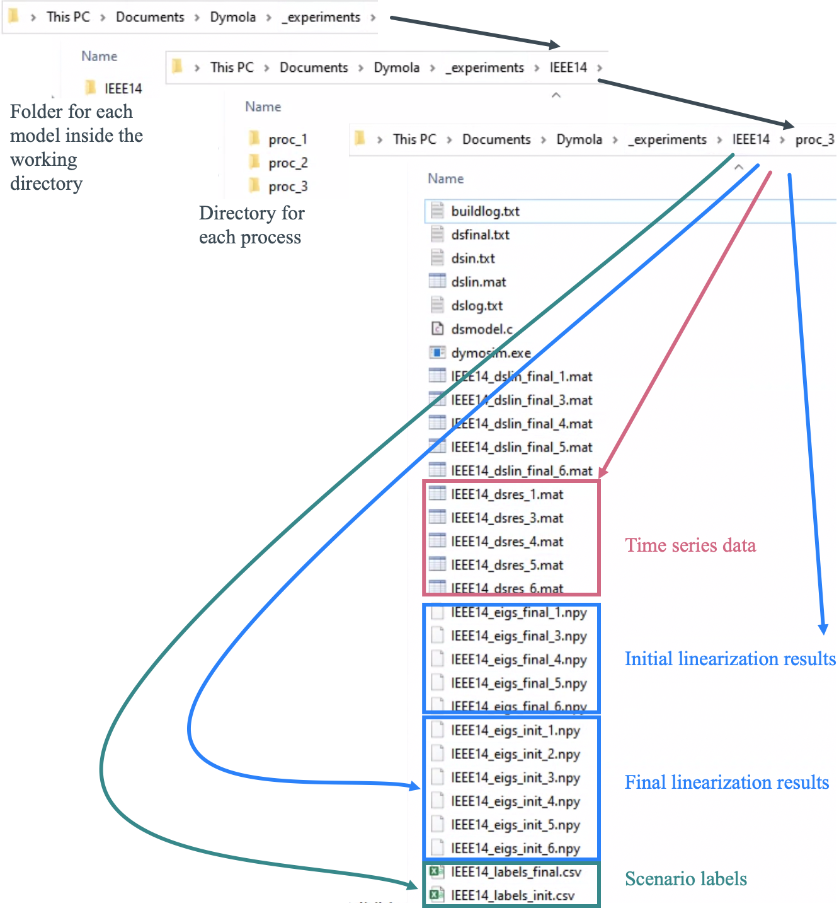

`run_sim` Module Tutorial
===========================


#### Background

The program carries out two linearization routines alongside with the numerical integration that produces the time-domain simulation results (see the Figure below where the process behind a single run is illustrated).

{ width=75% }

First, for a given power flow, an analytical linearization with the initial states $\mathbf{x}=\mathbf{x}_0$ is carried out. The resulting eigenvalues and small-signal stability labels are saved. Afterwards, the dynamic simulation is carried out under the contingency scenario specified for the run, producing a `*.mat` file as an output. After completing the numerical integration, another linearization at the final conditions $\mathbf{x}=\mathbf{x}_f$ is run, exporting eigenvalues and labels at the final simulation conditions. This process is repeated until all contingencies are simulated for all power flows, or until the maximum number of simulations (`--n_sim`) is reached. That is, another power flow is selected and the behavior of the system for the selected set of contingencies is simulated. It is important to remark that the contingency scenarios are split among the processes on which the simulations are run. In other words, if the user were to simulate `--n_sc 1000` contingencies along `--proc 5` processes, then each process would be assigned with 200 scenarios.

#### Example

As an example, running the following command will execute a maximum of 15 simulations (of a maximum of 20) using three processes, each running on two physical cores:

```python
python main.py run_sim --tool dymola --model IEEE14
    --proc 3 --cores 2 --n_pf 2 --n_sc 10 --n_sim 15
```

The execution information for this example is presented below.

```
=============================================
RUNNING DYNAMIC SIMULATIONS
=============================================

No OpenIPSL version specified. Defaulting to '1.5.0'
Setting simulations to run on pc
Working with 10 contingency scenarios
Working with 20 simulations

---------------------------------------------
Summary of time-domain simulation
---------------------------------------------
Model name                     IEEE14_Base_Case in package IEEE14
OpenIPSL version:              1.5.0
Tool                           dymola              
Process(es)                    3                  
Core(s) per process            2                   
Power flows                    2                   
Contingency scenarios          10                  
Max simulations:               15 (5/process)
```

#### Connection with the `extract` Module

To emphasize on the importance of the `extract` module, we will deep dive into the file output of the routine `run_sim`. One of the parameters that can be modified by the user in either `sim_parameters_pc.yaml` or `sim_parameters_vm.yaml` is the working directory (i.e., the location in the hard drive where the simulation results will be stored). The organization of files is presented in the Figure below.



In the given working directory, the program creates a folder called `_experiments`, where the results are organized inside a directory with the same name of the model (in this case, `IEEE14`). Inside `/_experiments/IEEE14`, a subfolder is created for each individual process. In the previous example, we commanded the simulations to run on three processes, so we observe three subdirectories: `proc_1`, `proc_2`, and `proc_3`. There, we observe the results for the time series data (`*.mat` files), initial and final linearization results (eigenvalues stored as `NumPy` arrays), and the small-signal stability labels for all simulated scenarios evaluated with the initial and final conditions as `*.csv` files.

Continue with the [next tutorial](tutorial_extract.md).
