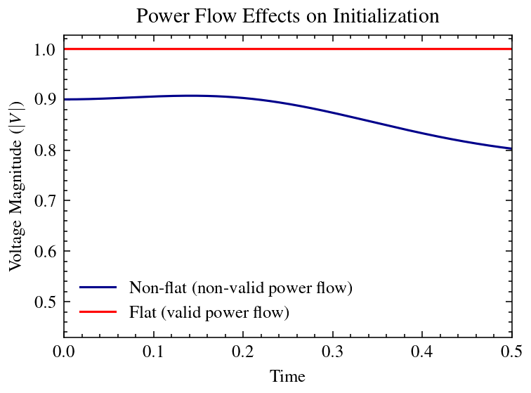

`val_pf` Module Tutorial
===========================


#### Background

The power flow solution is computed after solving a nonlinear system of equations numerically. Then, it is plausible that the power flow solver produces a _mathematically valid_ result that has no physical significance. In other words, despite being a solution of the nonlinear system of equations, a particular power flow result does not correspond to an equilibrium of the dynamical system under study. Then, when a simulation is run using such power flow as an initial condition, the states of the system drift and do not stay in the state coordinates specified by the power flow. Such a power flow result is meaningless as an initial condition for numerical integration. When the states remain in the equilibrium condition after the dynamic simulation starts, the model is said to _initialize flat_ and the power flow is therefore valid as an initial condition (see Figure below).

{ width=75% }

#### Example

In this short tutorial, we use the following command to execute the `val_pf` tool with Dymola running in two different processes to validate the power flows generated in the previous step:

```python
python main.py val_pf --tool dymola --model IEEE14
--proc 2 --cores 1
```

The information displayed to the user is presented below. Since the example above does not specify an OpenIPSL version, the program by default works with the `1.5.0` release and informs the user about it. Note that the total number of power flow validations corresponds to the 72 power flows generated with the `run_pf` function plus the base case power flow that accompanies each model, for a total of `73`.

```
=============================================
VALIDATING POWER FLOWS FOR DYNAMIC SIMULATIONS
=============================================

No OpenIPSL version specified. Defaulting to '1.5.0'

---------------------------------------------
Summary of power flow validation
---------------------------------------------
Model name                     IEEE14_Base_Case in package IEEE14
OpenIPSL version:              1.5.0
Tool                           dymola              
Process(es)                    2                   
Core(s) per process            1                   
Power flow validations         73                  

(2): dymola using port: 44069
(1): dymola using port: 44111
```

Continue with the [next tutorial](tutorial_run_sim.md).
